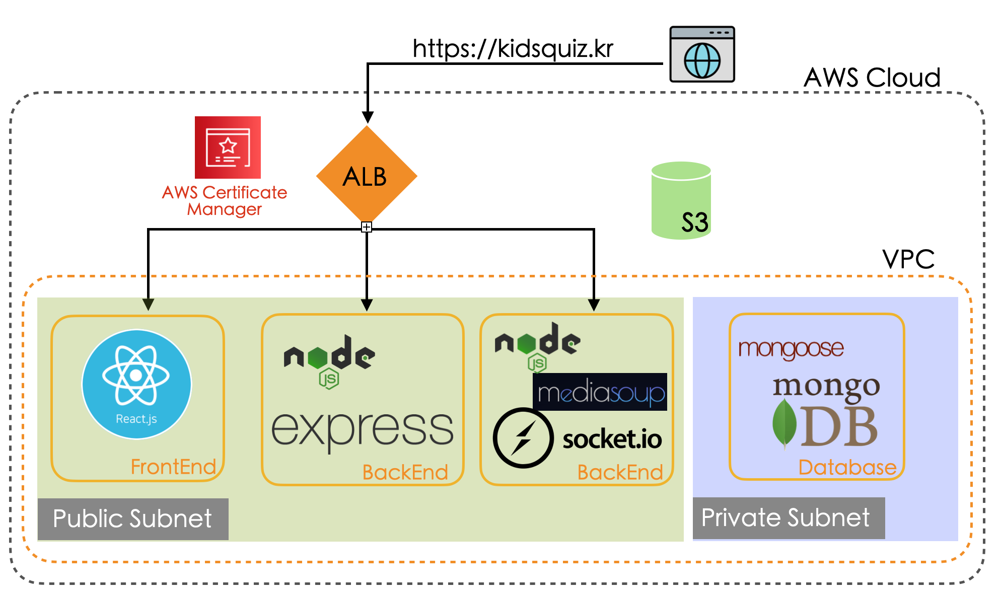
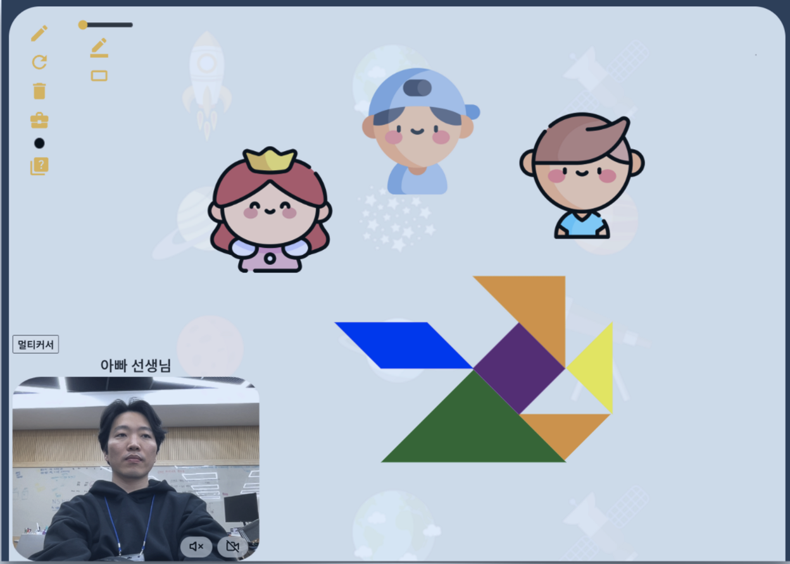
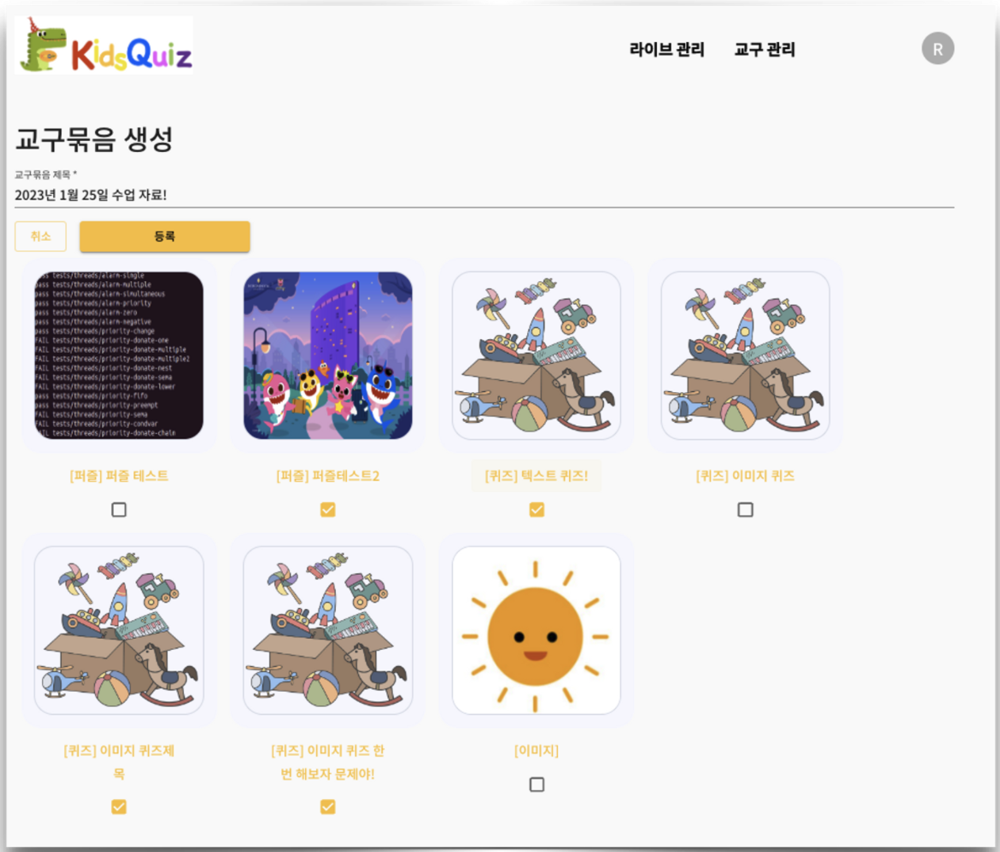
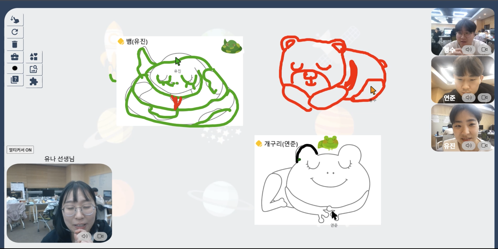

# ReadMe. BackEnd

## ✅ Kidsquiz 서비스 소개

COVID-19로 인한 유치원에서의 마스크 착용으로 아이들의 언어와 인지발달이 늦어진다는 사회적 문제를 개선하고자 생겨난 온라인 화상교육 플랫폼입니다. 선생님이 수업에 필요한 이미지, 퍼즐놀이, 그림 퀴즈, 글자 퀴즈 등 교구를 직접 만들고, 아이들과 마스크 없이 얼굴을 마주하고 직접 만든 교구로 다양한 상호작용을 할 수 있습니다.

## ✅ 서비스 구조도

- **Frontend**
    - ReactJS with socket.io-client / mediasoup-client
    - 🔗[frontend github repository](https://github.com/yoojinLiz/kidsquiz-frontend.git)
- **Backend**
    - nodeJS/Express with socket.io / mediasoup
    - mongoDB with mongoose
    - 🔗[backend github repository](https://github.com/yoojinLiz/kidsQuiz-backend.git) / 🔗[socket github repository](https://github.com/yoojinLiz/kidsquiz-socket)

## 🔎 기능 소개

### 어린이와 상호작용을 도와줄 기본 교구

아래의 기본 교구들을 교사와 아이들이 함께 쓰고 지우고 움직일 수 있어요! 

- 공유 캔버스
- 다양한 색깔과 두께의 펜과 지우개
- 다양한 색깔과 크기의 원, 삼각형, 사각형과 칠교 놀이

### 선생님이 **직접 만드는 교구**

교사가 수업에 사용할 이미지, 퀴즈, 퍼즐 교구를 직접 생성하고, 교구 묶음을 만들어 수업에 사용할 교구들을 지정할 수 있습니다

- 수업에 필요한 이미지들을 꺼내서 아이들과 함께 보고, 이미지 위에 직접 그림을 그릴 수 있어요
- 수업 중에 퀴즈를 꺼내서 풀면, 선생님은 각 아이들의 문제 풀이 결과를 알 수 있습니다
- 수업 중에 퍼즐을 꺼내서 풀면, 선생님과 아이들이 하나의 퍼즐을 함께 맞출 수 있습니다.

### 멀티커서

라이브 수업 진행 중 멀티 커서 모드를 on 하여 선생님과 아이들의 마우스 위치를 실시간으로 보여주는 기능.

선생님의 시점에서 특정 위치를 지정하거나, 어떤 아이가 무엇을 하고 있는지 확인 가능

아이들은 수업 중 친구들과 선생님의 커서를 인지하며 놀이에 참여할 수 있다.

### **지연없는 화상 채팅**

- mediasoup 라이브러리를 사용한 SFU 방식의 화상회의 시스템
- 클라이언트에 대한 부하를 줄여 지연이나 끊김없이 선생님의 목소리와 얼굴을 보며 상호작용
- 선생님이 직접 아이들의 화면/영상 제어가 가능
